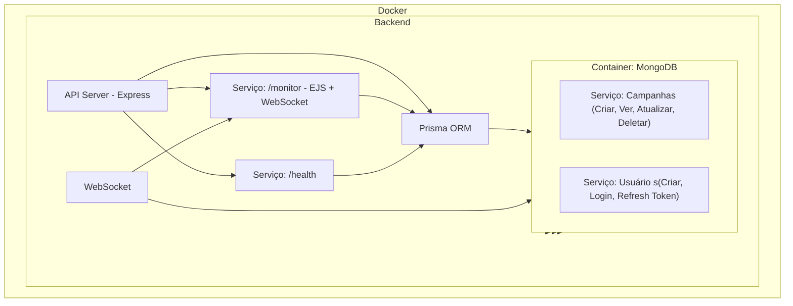

# Arquitetura e Escalabilidade

Esta documentação apresenta a arquitetura do sistema desenvolvido em Node.js, bem como estratégias para escalabilidade utilizando Redis, threads e outros componentes.

## Diagrama de Arquitetura

## Descrição dos Componentes

1. **Cliente/Front-end**  
   Aplicações web, mobile ou outros consumidores que se comunicam via API.

2. **Load Balancer**  
   Distribui as requisições entre múltiplas instâncias da API para evitar sobrecarga.

3. **API Server (Node.js)**  
   - Gerencia as requisições, autenticação (JWT com refresh token) e operações CRUD.
   - Utiliza o módulo *cluster* do Node.js para aproveitar múltiplos núcleos da CPU, aumentando a performance e a capacidade de processamento por meio de threads.
   - Conecta-se ao banco de dados, Redis para caching e sistemas de filas para tarefas assíncronas.

4. **Banco de Dados**  
   Utilizado para armazenamento persistente (ex.: PostgreSQL, MySQL, MongoDB).

5. **Cache (Redis)**  
   - Armazena dados com alta frequência de acesso, reduzindo a latência.
   - Pode ser utilizado para cache de sessões, resultados de consultas e gerenciamento de contadores.

6. **Fila (BullMQ)**  
   - Processamento de tarefas assíncronas, como envio de e-mails ou processamento de relatórios.

## Estratégias de Escalabilidade

### Escala Horizontal
- **API Server (Node.js)**:  
  - Utilizar o módulo *cluster* para criar múltiplos workers, cada um rodando em um núcleo diferente.
  - Implementar múltiplas instâncias da aplicação por meio do balanceador de carga.

- **Banco de Dados**:  
  - Utilizar réplicas de leitura (read replicas) e, se necessário, particionamento (sharding).

- **Cache (Redis)**:  
  - Configurar Redis em cluster para distribuir a carga e melhorar a performance.
  - Utilizar Redis para armazenar sessões e cache de dados que são acessados com frequência.

- **Fila (BullMQ/SQS)**:  
  - Dimensionar o número de workers que consomem mensagens conforme a demanda.

### Microserviços
- Com o crescimento da aplicação, considerar a separação por domínios:
  - **Serviço de Autenticação:** Exclusivo para gerenciamento de tokens e usuários.
  - **Serviço de Campanhas:** Lida com toda a lógica de negócios relacionada a campanhas.
  - **Serviço de Notificações e Processamento Assíncrono:** Responsável por tarefas como envio de emails e geração de relatórios.

### Outras Estratégias
- **Cache Dinâmico:** Utilização de Redis para cache de dados críticos e redução de latência.
- **Utilização de Threads:** Implementação de processamento paralelo com o módulo *cluster* do Node.js para melhor utilização dos recursos da máquina.
